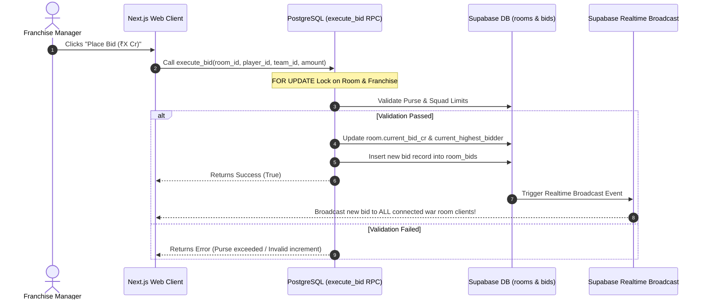

<div align="center">

# 🏏 DraftForge | IPL Mega Auction Simulator

<p align="center">
  <b>A real-time, multi-client IPL Cricket Manager Mega Auction War Room.</b><br />
  Experience the tactical intensity of the IPL Mega Auction live in your browser.
</p>

[](https://nextjs.org/)
[](https://www.typescriptlang.org/)
[](https://supabase.com/)
[](https://tailwindcss.com/)
[](https://opensource.org/licenses/MIT)

</div>

---

## 📌 Overview

**DraftForge** is a web-based, real-time multiplayer cricket manager draft room simulator built for IPL enthusiasts and strategy gaming fans. It mirrors the exact mechanics, financial constraints, and excitement of the official **IPL Mega Auction**.

Users can create or join public and private war rooms, claim any of the 10 official IPL franchises (CSK, MI, RCB, KKR, etc.), participate in live sub-second bidding wars, track real-time squad statistics, and view comprehensive post-game leaderboards.

---

## 🔥 Key Features

- ⚡ **Sub-Second Real-Time Bidding**: Powered by **Supabase Realtime Broadcast Channels** for instantaneous state synchronization across all connected clients.
- 🔒 **Atomic Concurrency Protection**: High-frequency bids are processed securely via custom PostgreSQL RPC functions (`execute_bid`) utilizing `FOR UPDATE` row-level database locks to eliminate race conditions.
- 📈 **Official Bidding Ladder Increments**: Automatically computes realistic IPL bidding steps:
  - Base price up to ₹1.00 Cr: **₹5 Lakh / ₹10 Lakh increments**
  - ₹1.00 Cr to ₹2.00 Cr: **₹10 Lakh / ₹20 Lakh increments**
  - ₹2.00 Cr to ₹5.00 Cr: **₹25 Lakh increments**
  - ₹5.00 Cr+: **₹50 Lakh increments**
- 🛡️ **Squad & Purse Constraints**: Enforces official IPL squad building rules:
  - Total Purse: **₹120.00 Crores** per team
  - Squad Size: **18 to 25 players**
  - Overseas Quota: **Maximum 8 overseas players**
- 🎮 **Multiple Game Modes**:
  - **Full Mega Auction**: Complete player pool across all sets.
  - **Mock 2026 Draft**: Curated star player pool for quick strategic drafts.
  - **Retired Legends**: Draft iconic past cricket legends.
- 🌐 **Room Discovery & Custom Lobbies**: Search public war rooms or create private 6-digit room code lobbies with customizable timers (5s, 10s, 15s, 30s).
- 💬 **Live War Room Chat & Activity Feed**: Real-time room chat and live ticker feed tracking all bids, sold events, and unsold updates.
- 📊 **Post-Auction Summary & Roster Analytics**: Detailed post-game results page compiling franchise rosters, purse remaining, overseas ratios, and squad balance metrics.

---

## 🛠️ Technology Stack

| Layer | Technology | Description |
| :--- | :--- | :--- |
| **Framework** | [Next.js 14](https://nextjs.org/) | App Router, Server Components, & API Routes |
| **Language** | [TypeScript](https://www.typescriptlang.org/) | Strict type-safety across client & server |
| **Database** | [PostgreSQL / Supabase](https://supabase.com/) | Relational database & Row-Level Security (RLS) |
| **Realtime** | [Supabase Realtime](https://supabase.com/realtime) | WebSocket broadcast channels & database change streams |
| **Styling** | [Tailwind CSS](https://tailwindcss.com/) | Dark mode styling, custom gradients, & glassmorphism |
| **Icons** | [Lucide React](https://lucide.dev/) | Crisp, modern UI icons |

---

## 📁 Codebase Directory Structure

```
IPL-Auction-simulator/
├── app/                              # Next.js App Router root
│   ├── api/                          # RESTful API route handlers
│   │   ├── health/                   # System health check endpoint
│   │   └── rooms/                    # Room management API endpoints
│   ├── guide/                        # Rules handbook & bidding strategy (/guide)
│   ├── players/                      # Complete searchable player registry (/players)
│   ├── rooms/                        # Public rooms directory (/rooms)
│   │   └── [code]/                   # Dynamic lobby wrapper under 6-digit code
│   │       ├── auction/              # Real-time bidding war room UI
│   │       └── results/              # Post-game leaderboard & roster breakdown
│   ├── globals.css                   # Global Tailwind utilities & ambient animations
│   ├── layout.tsx                    # Root layout wrapper & font provider
│   └── page.tsx                      # Landing home page
│
├── components/                       # Modular React components
│   ├── auction/                      # War room bidding components
│   │   ├── ActivePlayerCard.tsx      # Current player on bid card with live timer
│   │   ├── AuctionContext.tsx       # State provider for realtime socket events
│   │   ├── AuctionHeader.tsx         # Room title, timer, status, & share actions
│   │   ├── AuctionLobby.tsx          # Pre-game team selection lobby
│   │   ├── AuctionOverlays.tsx       # SOLD / UNSOLD modal animations & squad drawer
│   │   ├── AuctionTabs.tsx           # Room chat, activity feed, & franchise rosters
│   │   ├── BidControls.tsx           # Quick bid button & purse validator
│   │   ├── MySquadDrawer.tsx         # Slide-out squad management drawer
│   │   ├── TeamsScoreboard.tsx       # Real-time purse & squad size scoreboard
│   │   └── UpcomingQueue.tsx         # Up-next player bidding queue
│   ├── layout/                       # UI shells (Navbar, Footer)
│   ├── players/                      # Player registry search, filter, & cards
│   └── ui/                           # Reusable UI primitives (Buttons, Badges, Logos)
│
├── lib/                              # Core engines and database utilities
│   ├── auction-engine.ts             # Deterministic bid increment & validation logic
│   ├── design-tokens.ts              # Franchise colors, badges, & visual tokens
│   ├── supabase.ts                   # Supabase client connection setup
│   └── types/                        # TypeScript interfaces & types
│
├── public/                           # Static assets
│   └── logos/                        # Official high-resolution SVG & PNG franchise logos
│
└── scripts/                          # PostgreSQL database migrations & data seeders
```

---

## ⚡ Real-Time Bidding Architecture



---

## 🛠️ Getting Started

### Prerequisites

- **Node.js**: v18.0.0 or higher
- **Package Manager**: `npm` or `pnpm`
- **Database**: A [Supabase](https://supabase.com/) project

### Environment Setup

Create a `.env.local` file in the root directory:

```env
NEXT_PUBLIC_SUPABASE_URL=https://your-supabase-project.supabase.co
NEXT_PUBLIC_SUPABASE_ANON_KEY=your-supabase-anon-key
```

### Database Migration & Seeding

Run the SQL scripts located in the `scripts/` folder in your Supabase SQL Editor in numerical order:

1. `scripts/01-create-players-table.sql`
2. `scripts/02-create-teams-and-players.sql`
3. `scripts/03-setup-auction-rooms.sql`
4. `scripts/04-enable-realtime.sql`
5. `scripts/06-atomic-bids.sql`
6. `scripts/12-transactional-advance.sql`

### Local Development

```bash
# Clone the repository
git clone https://github.com/cax6505/DraftForge.git
cd DraftForge

# Install dependencies
npm install

# Start the local development server
npm run dev
```

Open [http://localhost:3000](http://localhost:3000) in your browser to view the application.

---

## 📜 Database SQL Migrations

The `scripts/` directory contains all SQL scripts for setting up schema tables, indexes, RPC functions, and seeds:

- `01-create-players-table.sql`: Primary player schema.
- `02-create-teams-and-players.sql`: Initial franchise definitions.
- `03-setup-auction-rooms.sql`: Auction rooms, bids, and sold players tables.
- `04-enable-realtime.sql`: Enables Supabase publication streams.
- `06-atomic-bids.sql`: Concurrency-safe bid execution RPC.
- `12-transactional-advance.sql`: Player state advancement RPC.

---

## 🤝 Contributing

Contributions are welcome! If you'd like to improve the simulator or add new features:

1. Fork the project repository.
2. Create your feature branch (`git checkout -b feature/AmazingFeature`).
3. Commit your changes (`git commit -m 'feat: Add some AmazingFeature'`).
4. Push to the branch (`git push origin feature/AmazingFeature`).
5. Open a Pull Request.

---

## 📄 License

Distributed under the **MIT License**. See `LICENSE` for more information.

<div align="center">
  <sub>Built with ❤️ for Cricket & Tech Enthusiasts.</sub>
</div>
